# DCMS - Digital Compliance Management System

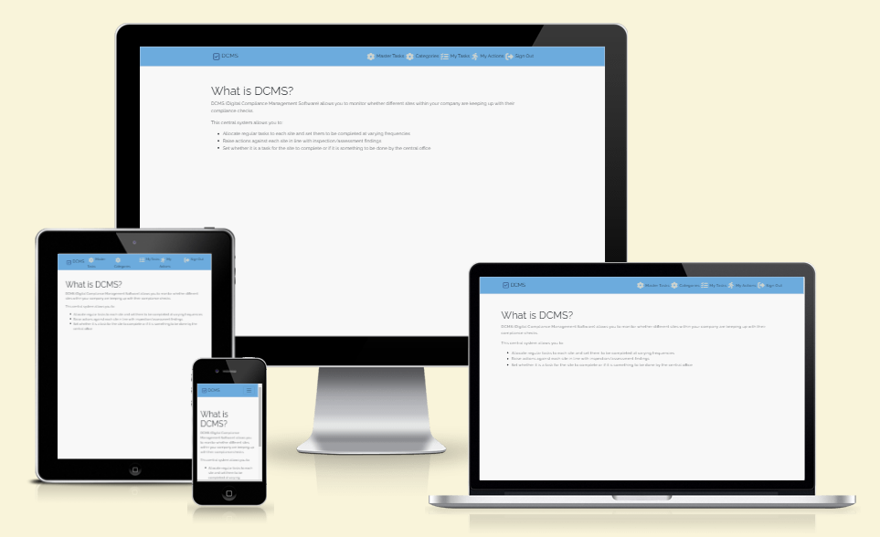

The live link for the site can be found here - https://project5-dcms-react.herokuapp.com/

The live link for the API can be found here - https://project5-dcms-drf-api.herokuapp.com/

# Table of Contents
- [Overview](#overview)
- [UX](#ux)
  - [Strategy](#strategy)
  - [Scope](#scope)
  - [Structure](#structure)
  - [Skeleton](#skeleton)
  - [Surface](#surface)
- [Languages Used](#languages-used)
- [Features](#features)
  - [Existing Features](#existing-features)
  - [Other Features](#other-features)
  - [Future Features](#future-features)
- [Testing](#testing)
  - [Manual Test of User Stories](#manual-test-of-user-stories)
  - [Test on Alternative Browsers and Screen Size](#test-on-alternative-browsers-and-screen-size)
  - [Validator Testing](#validator-testing)
  - [Unfixed Bugs](#unfixed-bugs)
- [Libraries and Programs Used](#libraries-and-programs-used)
- [Deployment](#deployment)
- [Credits](#credits)
  - [Content](#content)

# Overview

This site was developed to address a problem which occurred during my previous employment as a Senior Account Manager for a Health and Safety Consultancy. I worked with clients with a large estate of sites throughout the UK. The central health and safety team did not know whether any of the compliance checks were being completed unless they attended site and reviewed the paper checklists used to record the completion of tasks or actions. I have created this site as a way of solving this issue.

# UX

I have found that using the React library and it implemented feature has contributed to improve the user experience by:

- Helping the user to avoid refreshing the page
- The website responding quickly to the users interactions
- The web pages loading faster
- Improving the performance of the site by removing the need to implement the same functionality twice

This site was created respecting the Five Planes Of Website Design:

## Strategy

**Typical User**

*Site User*

A typical Site User would be a site manager responsible for the health and safety compliance checks. 

*Site Admin*

A typical Site Admin may be a Health and Safety Manager wanting to ensure that each of their site managers are completing their statutory compliance checks.

**Project Goals**

The project goals of this site are to:

- Make it quicker and easier for the user to record the completion of safety compliance checks
- Improve the uptake of site managers completing checks
- Improve the ease of safety auditing as records of all checks are detailed in a central location

**User Stories** 

*Navigation & Authentication*

- Navigation: As a **site user** I can **view a navbar from every page** so that **I can navigate easily between pages**.
- Routing: As a **site user** I can **navigate through pages quickly** so that **I can view content seamlessly without page refresh**.
- Authentication - Sign up: As a **site user** I can **create a new account** so that **I can access all the features for signed up users**.
- Authentication - Sign in: As a **site user** I can **sign in to the app** so that **I can access functionality for logged in users**.
- Authentication - Logged in Status: As a **site user** I can **tell if I am logged in or not** so that **I can log in if I need to**.
- Authentication - Refreshing access tokens: As a **site user** I can **maintain my logged-in status until I choose to log out** so that **my user experience is not compromised**.
- Navigation - Conditional rendering: As a **logged out user** I can **I can see sign in and sign up options** so that **I can sign in/sign up**.
- Infinite Scroll: As a **site user** I can **keep scrolling through tasks and actions** so that **I don't have to click on "next page" etc**.

*Categories*

- View Categories List: As a **site admin** I can **view the categories list** so that **I can ensure that all appropriate categories are available to be allocated to a task or action**.
- Add Categories: As a **site admin** I can **create a category** so that **it can be allocated to a task or action**.
- Edit Categories: As a **site admin** I can **edit a category** so that **the correct category can be allocated to a task or action**.
- Delete Categories: As a **site admin** I can **delete a category** so that **it is no longer available to be allocated to a task or action**.

*Master Tasks*

- View Master Task List: As a **site admin** I can **view the master task list** so that **to ensure all users have been allocated the appropriate tasks**.
- View Master Task Details: As a **site admin** I can **view the master task details** so that **to ensure that the correct information has been set on a master task**.
- Add Master Task: As a **site admin** I can **add a master task** so that **I am able to allocate a master task to a user**.
- Edit Master Task: As a **site admin** I can **edit a master task** so that **I am able to update a master task if any of the requirements change**.
- Delete Master Task: As a **site admin** I can **delete a master task** so that **it is no longer available to be allocated to a user**.
- Search for Master Tasks:	As a **site admin** I can **search for master tasks** so that **so it is easy to find the master task which I am looking for**.

*Assign Tasks*

- Allocate Master Task to User: As a **site admin** I can **allocate a master task to a user** so that **so a user task can be allocated to them to ensure that an activity is being completed**.
- Set Completed By: As a **site admin** I can **set who the task is to be completed by** so that **either the admin or the user is aware that a task requires completing by them**.

*User Tasks*

- Add User Task: As a **site admin** I can **automatically create a user task once a master task has been allocated** so that **I know a user task has been created which requires completion**.
- View User Task List: As a **site user/site admin** I can **view the user tasks which are to be completed by me** so that **I am aware what tasks I need to completed**.
- View Overdue User Task List: As a **site user/site admin** I can **view the overdue user tasks which are to be completed by me** so that **I can prioritise completing tasks which are overdue**.
- Filter User Tasks: As a **site user/site admin** I can **filter user tasks** so that **so it is easy to find the user task which I am looking for**.
- Search for User Tasks: As a **site user/site admin** I can **search for user tasks** so that **so it is easy to find the user task which I am looking for**.
- View User Task Details: As a **site user/site admin** I can **view a user tasks details** so that **I am aware what tasks I need to completed**.
- Update User Task Status: As a **site user/site admin** I can **update a user tasks status** so that **I can record whether a task has been completed or is in progress**.
- Add Image to User Task: As a **site user/site admin** I can **add an image to a user task** so that **I can provide additional evidence that a task has been completed or that an issue was identified**.

*User Tasks: Comments*

- View Task Comments: As a **site user/site admin** I can **view task comments** so that **I can read the log of detailed information recorded about a task**.
- Add Task Comment: As a **site user/site admin** I can **add a comment to a task** so that **I can record whether an issue has been raised or detail information about the completion of a task**.
- Edit Task Comment: As a **site user/site admin** I can **edit a task comment** so that **I can update an error made in a comment**.
- Delete Task Comment: As a **site user/site admin** I can **delete a task comment** so that **I can delete a comment which has been incorrectly submitted**.
- Task Status Update Comment: As a **site user/site admin** I can **automatically add a comment to detail a change in an tasks status** so that **the comments have a log of any changes to the status of the task**.

*Actions*

- View Action List: As a **site user/site admin** I can **view the actions which are to be completed by me** so that **I am aware what actions I need to completed**.
- View Action Details: As a **site user/site admin** I can **view an actions details** so that **I am aware of the details of the action which I need to completed**.
- Add Action: As a **site user/site admin** I can **add an action** so that **I can record any issues identified so they can be addressed at a later date**.
- Add Action related to a Task: As a **site user/site admin** I can **raise an action if an issue was raise when completing a task** so that **I can record any issues identified when completing a task so they can be addressed at a later date**.
- Edit Action: As a **site user/site admin** I can **edit an action** so that **I am able to update an action if any of the requirements change**.
- Delete Action: As a **site user/site admin** I can **delete an action** so that **I can delete an action which has been incorrectly submitted**.

*Actions: Comments*

- View Action Comments: As a **site user/site admin** I can **view action comments** so that **I can read the log of detailed information recorded about an action**.
- Add Action Comment: As a **site user/site admin** I can **add a comment to an action** so that **I can log the progress of the completion of an action**.
- Edit Action Comment: As a **site user/site admin** I can **edit an action comment** so that **I can update an error made in a comment**.
- Delete Action Comment: As a **site user/site admin** I can **delete an action comment** so that **I can delete a comment which has been incorrectly submitted**.
- Action Status Update Comment: As a **site user/site admin** I can **automatically add a comment to detail a change in an actions status** so that **the comments have a log of any changes to the status of the action**.

The user stories where managed in a Kanban board which was created in [GitHub Projects](https://github.com/users/TuckerFaulk/projects/5/views/1?visibleFields=%5B%22Title%22%2C%22Assignees%22%2C%22Status%22%2C%22Labels%22%2C%22Milestone%22%5D). User stories were then prioritized with the MoSCoW approach and labels where used to manage this. The kanban board was split into five columns to manage the various stages of development:

1. To do: This item hasn't been started
2. In Progress - DRF API: This item is actively being worked on in the DRF API
3. To do - React: This item has tasks related to the React App which have not been started
4. In Progress - React: This item is actively being worked on in the React App
5. Done: All tasks related to the DRF API and the React App have been completed

## Scope

An MVP (Minimum Viable Product) approach was taken to the development of this site.

The main features deemed as basic requirements for this site were:

- Account Registration
- CRUD Functionality (Both Site User and Site Admin)
- Device Responsiveness

For detailed explanation of all existing features see [Existing Features](#existing-features). While [Future Features](#future-features) were still within the possible scope of this project, they were deemed unnecessary at this point in time.

## Structure

**Site Navigation Flowchart**

## Skeleton

**Wireframes**

*Master Tasks, My Tasks and My Actions List*

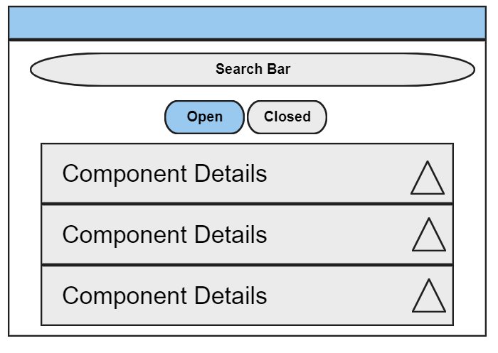

*Master Task Detail (including assigned to list)*

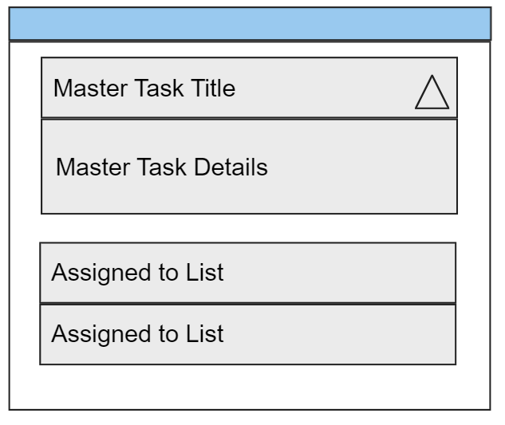

*Categories List*

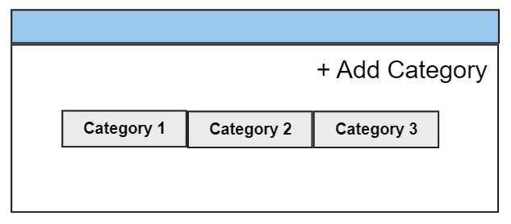

*My Task Detail (including update form and comments)*

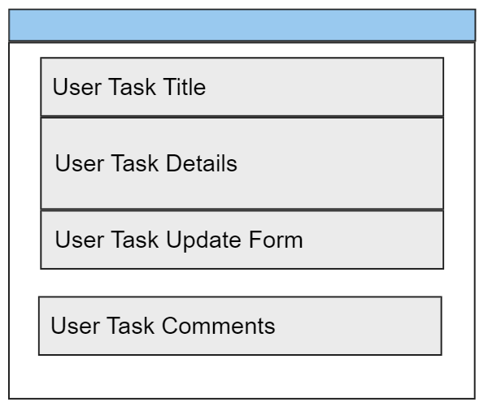

*My Action Detail (including update form and comments)*

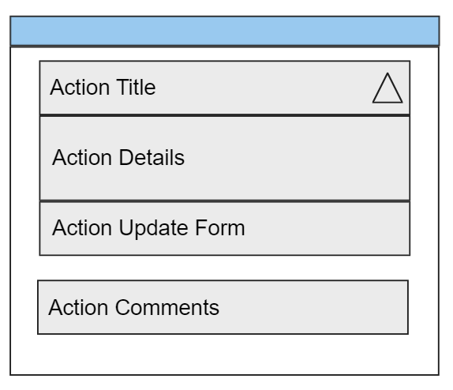

**Database Schema**

Data normalisation to structure each relational model to help reduce data redundancy and improve data integrity was used after initially setting out all of the information required for the site.

## Surface

**Visual Design**

I selected 'Raleway' as the font style used throughout the site to keep it simple.

The navbar background colour of light blue (#6CABDD) was also selected to keep with the minimalist style. I wanted to keep the main background white but then use the colours of the heading background for table headings to ensure that they were the main central focus of the page. Different colours have been used for the buttons on the site to make these easily distinguishable.

Icons were added to buttons throughout the site to aid the understanding of the functionality of that button.

# Languages Used

- HTML
- CSS
- JavaScript
- SQL (Postgres)

# Features

## Existing Features

### Home Page

- The home page provides context of what the site does and how it can provide benefit to the user.

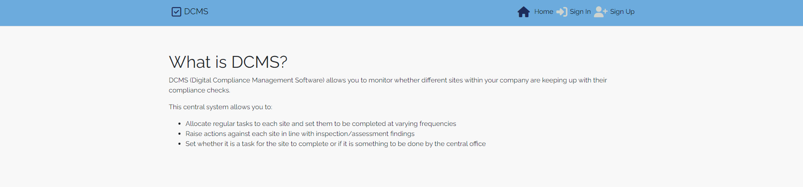

### Logo

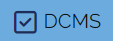

### Navigation

*Logged Out*

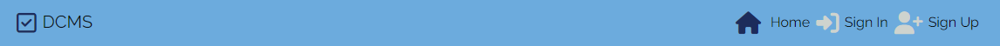

*User - Logged In*

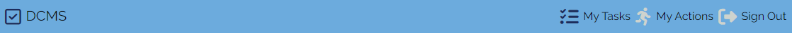

*Admin - Logged In*

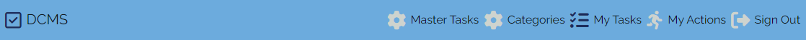

*Mobile*

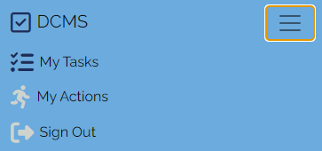

### Favicon

### Master Tasks

*Master Task List*

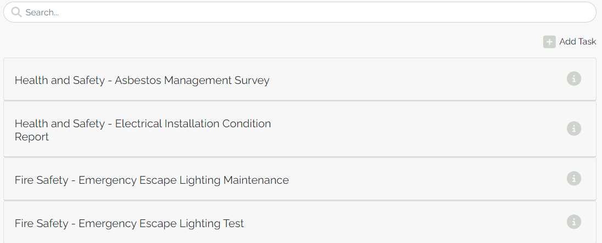

*Master Task Detail*

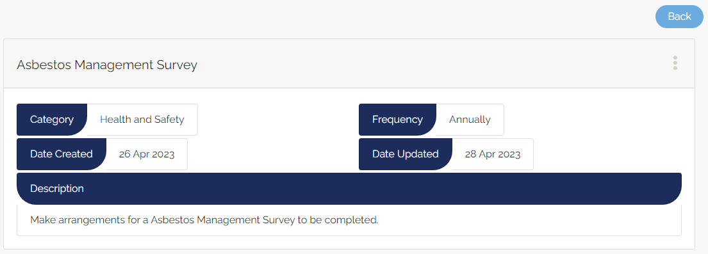

*Add Master Task*

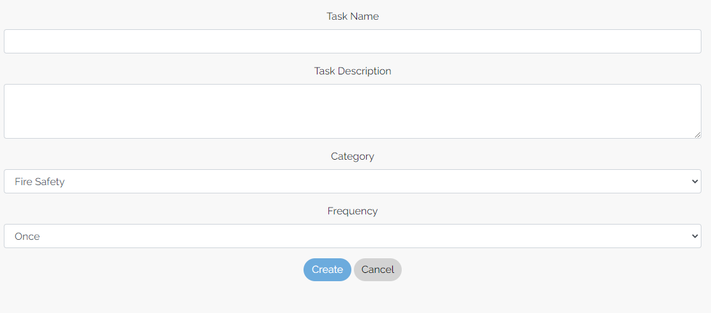

*Edit Master Task*

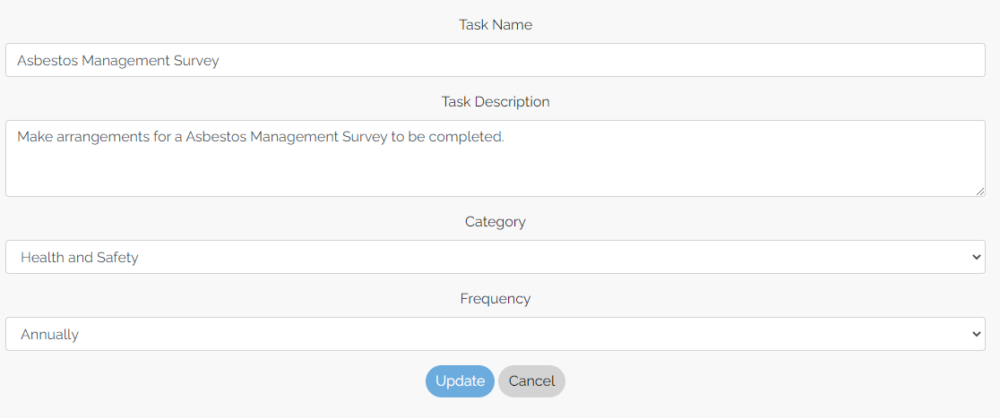

### Assign Master Task

*Assign Master Task List*

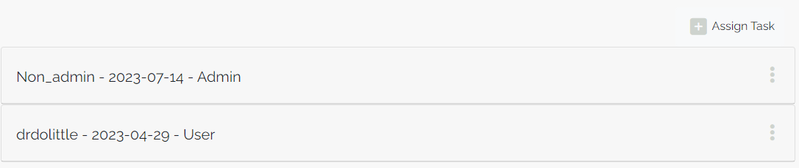

*Add - Assign Master Task*

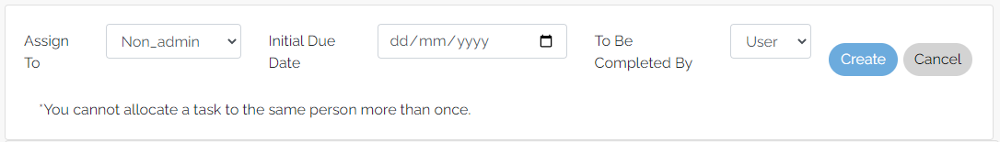

### Categories

*Categories List*

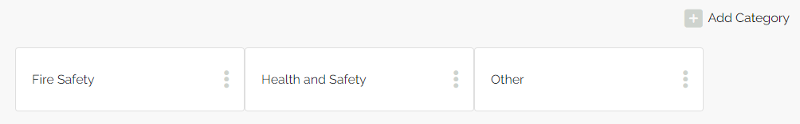

*Add Category*

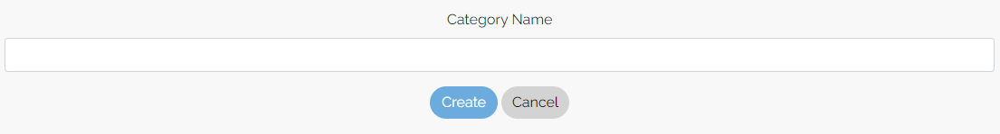

*Edit Category*

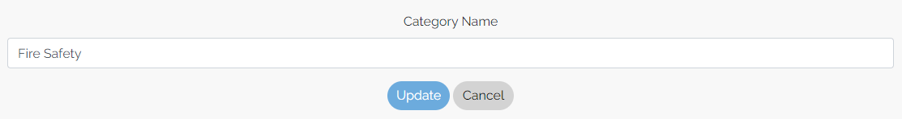

### My Tasks

*My Task List*

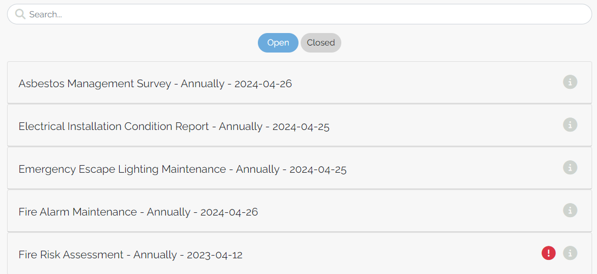

*My Task Detail (including Update My Task and Comments)*

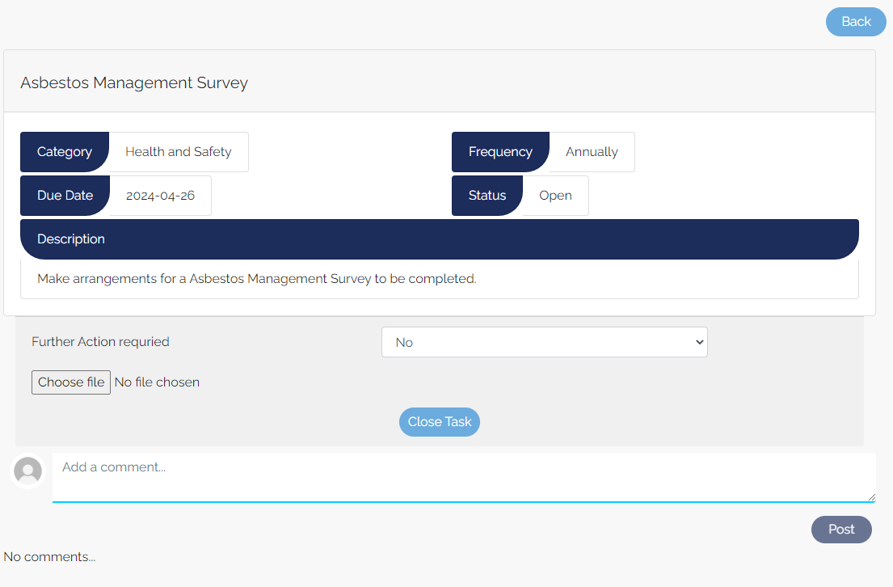

### Actions

*Action List*

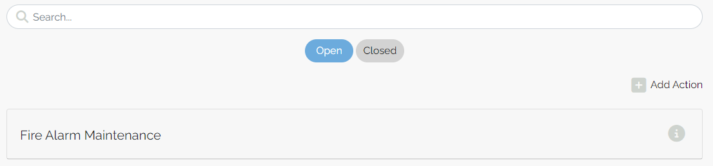

*Action Detail (including Update Action and Comments)*

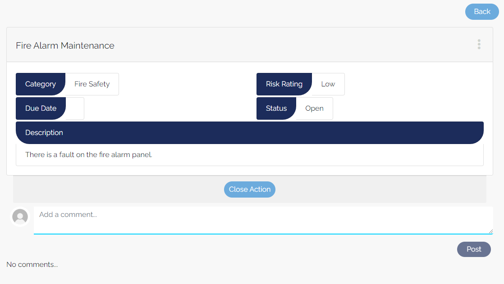

*Add Action - Admin*

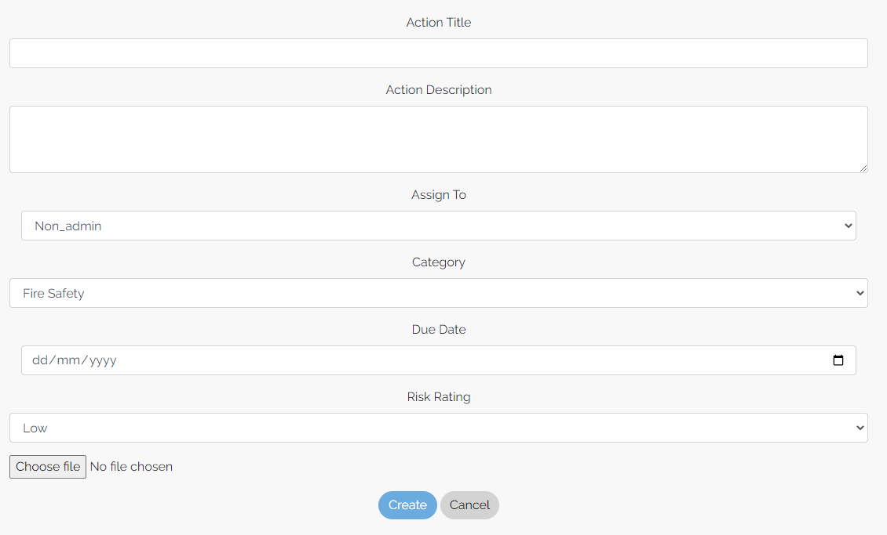

*Add Action - User*

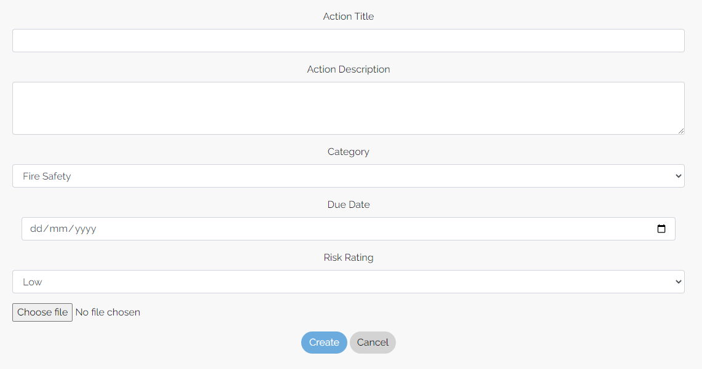

- A separate add action page is displayed for users as they can only allocate actions to themselves

*Edit Action*

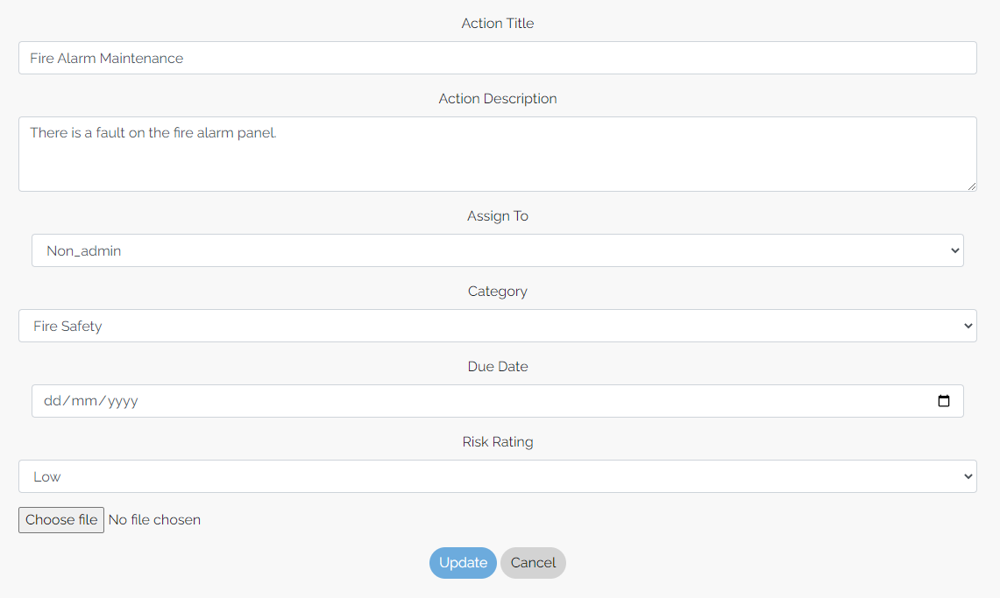

## Other Features

- Infinite Scroll
- Tasks/Actions Overdue Icon

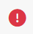

## Future Features

- As a **site user** I can **detail profile requirements** so that **tasks are not allocated to me which are not relevant (gas safety inspection is not allocated if there is no gas onsite)**.
- As a **site user** I can **view my user profile** so that **I can ensure that I have the most up to date information displayed about me**.
- As a **site admin** I can **view all users profile statistics** so that **I can monitor the performance of a site user**.
- As a **site admin** I can **allocate a master task to all users** so that **it is easy to allocate all tasks to multiple users**.
- As a **site user** I can **see my profile stats: number of open tasks and actions** so that **I can easily see how many tasks or actions I have allocated to me to complete**.

# Testing

## Manual Test of User Stories

| User Story Tested |  Passed |
|-------|:--------:|
|Navigation: As a **site user** I can **view a navbar from every page** so that **I can navigate easily between pages**.|☑|
|Routing: As a **site user** I can **navigate through pages quickly** so that **I can view content seamlessly without page refresh**.|☑|
|Authentication - Sign up: As a **site user** I can **create a new account** so that **I can access all the features for signed up users**.|☑|
|Authentication - Sign in: As a **site user** I can **sign in to the app** so that **I can access functionality for logged in users**.|☑|
|Authentication - Logged in Status: As a **site user** I can **tell if I am logged in or not** so that **I can log in if I need to**.|☑|
|Authentication - Refreshing access tokens: As a **site user** I can **maintain my logged-in status until I choose to log out** so that **my user experience is not compromised**.|☑|
|Navigation - Conditional rendering: As a **logged out user** I can **I can see sign in and sign up options** so that **I can sign in/sign up**.|☑|
|Infinite Scroll: As a **site user** I can **keep scrolling through tasks and actions** so that **I don't have to click on "next page" etc**.|☑|
|View Categories List: As a **site admin** I can **view the categories list** so that **I can ensure that all appropriate categories are available to be allocated to a task or action**.|☑|
|Add Categories: As a **site admin** I can **create a category** so that **it can be allocated to a task or action**.|☑|
|Edit Categories: As a **site admin** I can **edit a category** so that **the correct category can be allocated to a task or action**.|☑|
|Delete Categories: As a **site admin** I can **delete a category** so that **it is no longer available to be allocated to a task or action**.|☑|
|View Master Task List: As a **site admin** I can **view the master task list** so that **to ensure all users have been allocated the appropriate tasks**.|☑|
|View Master Task Details: As a **site admin** I can **view the master task details** so that **to ensure that the correct information has been set on a master task**.|☑|
|Add Master Task: As a **site admin** I can **add a master task** so that **I am able to allocate a master task to a user**.|☑|
|Edit Master Task: As a **site admin** I can **edit a master task** so that **I am able to update a master task if any of the requirements change**.|☑|
|Delete Master Task: As a **site admin** I can **delete a master task** so that **it is no longer available to be allocated to a user**.|☑|
|Search for Master Tasks	As a **site admin** I can **search for master tasks** so that **so it is easy to find the master task which I am looking for**.|☑|
|Allocate Master Task to User: As a **site admin** I can **allocate a master task to a user** so that **so a user task can be allocated to them to ensure that an activity is being completed**.|☑|
|Set Completed By: As a **site admin** I can **set who the task is to be completed by** so that **either the admin or the user is aware that a task requires completing by them**.|☑|
|Add User Task: As a **site admin** I can **automatically create a user task once a master task has been allocated** so that **I know a user task has been created which requires completion**.|☑|
|View User Task List: As a **site user/site admin** I can **view the user tasks which are to be completed by me** so that **I am aware what tasks I need to completed**.|☑|
|View Overdue User Task List: As a **site user/site admin** I can **view the overdue user tasks which are to be completed by me** so that **I can prioritise completing tasks which are overdue**.|☑|
|Filter User Tasks: As a **site user/site admin** I can **filter user tasks** so that **so it is easy to find the user task which I am looking for**.|☑|
|Search for User Tasks: As a **site user/site admin** I can **search for user tasks** so that **so it is easy to find the user task which I am looking for**.|☑|
|View User Task Details: As a **site user/site admin** I can **view a user tasks details** so that **I am aware what tasks I need to completed**.|☑|
|Update User Task Status: As a **site user/site admin** I can **update a user tasks status** so that **I can record whether a task has been completed or is in progress**.|☑|
|Add Image to User Task: As a **site user/site admin** I can **add an image to a user task** so that **I can provide additional evidence that a task has been completed or that an issue was identified**.|☑|
|View Task Comments: As a **site user/site admin** I can **view task comments** so that **I can read the log of detailed information recorded about a task**.|☑|
|Add Task Comment: As a **site user/site admin** I can **add a comment to a task** so that **I can record whether an issue has been raised or detail information about the completion of a task**.|☑|
|Edit Task Comment: As a **site user/site admin** I can **edit a task comment** so that **I can update an error made in a comment**.|☑|
|Delete Task Comment: As a **site user/site admin** I can **delete a task comment** so that **I can delete a comment which has been incorrectly submitted**.|☑|
|Task Status Update Comment: As a **site user/site admin** I can **automatically add a comment to detail a change in an tasks status** so that **the comments have a log of any changes to the status of the task**.|☑|
|View Action List: As a **site user/site admin** I can **view the actions which are to be completed by me** so that **I am aware what actions I need to completed**.|☑|
|View Action Details: As a **site user/site admin** I can **view an actions details** so that **I am aware of the details of the action which I need to completed**.|☑|
|Add Action: As a **site user/site admin** I can **add an action** so that **I can record any issues identified so they can be addressed at a later date**.|☑|
|Add Action related to a Task: As a **site user/site admin** I can **raise an action if an issue was raise when completing a task** so that **I can record any issues identified when completing a task so they can be addressed at a later date**.|☑|
|Edit Action: As a **site user/site admin** I can **edit an action** so that **I am able to update an action if any of the requirements change**.|☑|
|Delete Action: As a **site user/site admin** I can **delete an action** so that **I can delete an action which has been incorrectly submitted**.|☑|
|View Action Comments: As a **site user/site admin** I can **view action comments** so that **I can read the log of detailed information recorded about an action**.|☑|
|Add Action Comment: As a **site user/site admin** I can **add a comment to an action** so that **I can log the progress of the completion of an action**.|☑|
|Edit Action Comment: As a **site user/site admin** I can **edit an action comment** so that **I can update an error made in a comment**.|☑|
|Delete Action Comment: As a **site user/site admin** I can **delete an action comment** so that **I can delete a comment which has been incorrectly submitted**.|☑|
|Action Status Update Comment: As a **site user/site admin** I can **automatically add a comment to detail a change in an actions status** so that **the comments have a log of any changes to the status of the action**.|☑|

## Test on Alternative Browsers and Screen Size

|   Test   |   Small (≥576px) |  Medium (≥768px)   |   Large (≥992px)   |   Functionality (Pass)   |
|----------|:----------------:|:------------------:|:------------------:|:------------------------:|
|Chrome    |      ☑           |         ☑         |         ☑         |            ☑             |
|Safari    |      ☑           |         ☑         |         ☑         |            ☑             |
|Firefox   |      ☑           |         ☑         |         ☑         |            ☑             |
|Edge      |      ☑           |         ☑         |         ☑         |            ☑             |

## Validator Testing

- CSS: No errors were found when passing through the official W3C CSS validator.

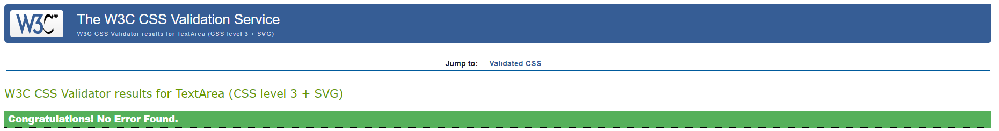

- JSHint: The following issues were raised, and have been intentionally ignored as they are in relation later version of ES:

1. Unclosed regular expression.
2. 'async functions' is only available in ES8 (use 'esversion: 8').
3. 'Optional chaining' is only available in ES11 (use 'esversion: 11').
4. 'object spread property' is only available in ES9 (use 'esversion: 9').

- Lighthouse (Accessibility Audit): The page achieved a great accessibility rating.

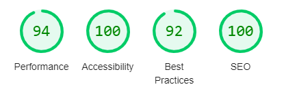

## Unfixed Bugs

- CurrentProfileContext

The CurrentProfileContext was created to retrieve profile data from the API and provide profile data to child components. The appropriate information is requested from the API based on the information retrieved from the CurrentUserProvider. Something when refreshing the page, a 404 error is raised. It is thought that the CurrentUserProvider has not yet retrieved its information before the CurrentProfileContext is initially run. It is noted that the CurrentProfileContext does work as the information is then retrieved from the API on the second request after the CurrentUserProvider has completed its. I have spoken to the CI tutor and they have stated for me to ignore this.

- Warning: validateDOMNesting(...): ul cannot appear as a descendant of p and Warning: validateDOMNesting(...): div cannot appear as a descendant of p

The above error messages display when console.logs are turned on on the following pages: MasterTaskPage, UserTaskPage and ActionPage. Discussed this with CI Tutors and we could not work out why it is throwing this error are there are no div's as a descendant of a p, or ul's as a descendant of a p.

# Libraries and Programs Used

- Github: Store Repository
- Gitpod: IDE
- Heroku: Site Deployment
- Cloudinary: Serving static media files
- ElephantSQL: PostgreSQL database hosting
- React.js: Front-end application
- React-Bootstrap: CSS styling library
- Google Chrome, Microsoft Edge, Mozilla Firefox, Safari: Site testing on alternative browsers
- Chrome Dev Tools: Debugging and CSS testing of the site
- Microsoft OneNote: Planning notes for the project
- Microsoft Whiteboard: Developing wireframes
- Am I Responsive: Screenshots of the final project for the README file
- Lucid Charts: Planning the site process with a flow diagram
- Google Fonts: For the font families
- Font Awesome: To add icons to the site
- Real Favicon Generator: Creating Favicon
- Jwt-decode: Used to decode and extract information from a JWT token.
- Axios: Promise based HTTP client for the browser and node.js. Used to make HTTP requests from throughout the application.

# Components

Several components have been reused throughout this project:

1. axiosDefault.js: For ease of communication with the backend API
2. Asset.js: To supply the loading spinner throughout the site
3. DropdownMenu.js: To allow users to edit/delete their Master Tasks, Categories, Actions and Comments
4. CurrentUserContext.js: To confirm that a user is logged-in and to determine what functionality is available to that user
5. CurrentProfileContext.js: To see whether a user is an admin and then display the appropiate additional functionality
6. useRedirect.js: Redirects the user to another page if they are not authorised to be on the page they are trying to access
7. utils.js: Supplies functionality to all of the components that utilise the Infinite Scroll
8. StatusFilter.js: Adds filter functionality to the list pages

# Deployment

This project was deployed on Heroku using Code Institute's Videos. After creating a GitHub repository, the steps taken to create the Heroku App were:

1. Run terminal command **npx create-react-app . --use-npm** to create React app, once the workspace has loaded. 
2. Run terminal command **npm start** to check app is working, once the app is installed.
3. Run terminal command **npm install react-bootstrap@1.6.3 bootstrap@4.6.0** to install Bootstrap.
4. In App.js, replace the standard React Header element with some text and remove the logo import. 
5. Confirm the added test renders in the browser preview then add, commit and push changes. 
6. Create a new Heroku app. 
7. Go to 'Settings' and confirm that the "heroku/nodejs" buildpack is present.
8. Click on the 'Deploy' tab and click on GitHub in the 'Deployment Method'.
9. Go to 'App connected to GitHub'. Search and select the relevant repository and click 'Connect'.
10. Go to 'Manual Deploy' section and click 'Deploy Branch'. 
11. Click 'Open App' button to view newly deployed app. 

# Final Deployment

1. Add a Procfile at the root of the project.
2. Committed all finalised code and pushed to Github. 
3. Open up the dashboard for your react app in Heroku.
4. Manually Deploy Branch.
5. Click the "Open App" button.
6. To ensure it matches the development version, test the final deployed version of the app. 

# Credits

I have again enjoyed learning with the Code Institute and completing my fifth assignment. I would like to thank my mentor Martina for her support, the CI Student Support Team and the CI Slack Community. Finally a big thank you to my girlfriend for her help with testing and the review of this site.

## Content

**Resources Used:**

- Code Institutes Walkthrough Videos
- React Bootstrap documentation was relied upon for assistance with page layouts and components.
- W3C Schools and Stack Overflow for general enquiries relating to React.js.

[Back to Top](#table-of-contents)