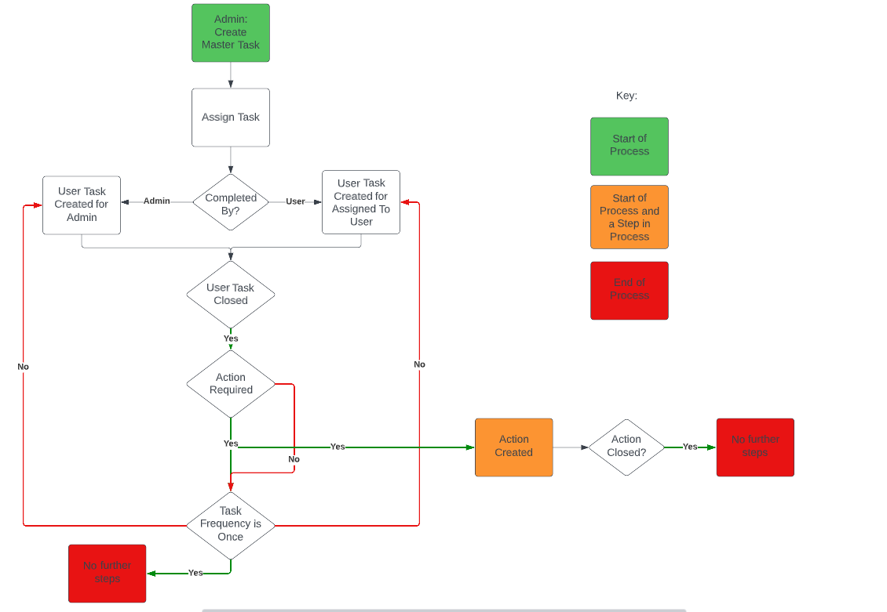
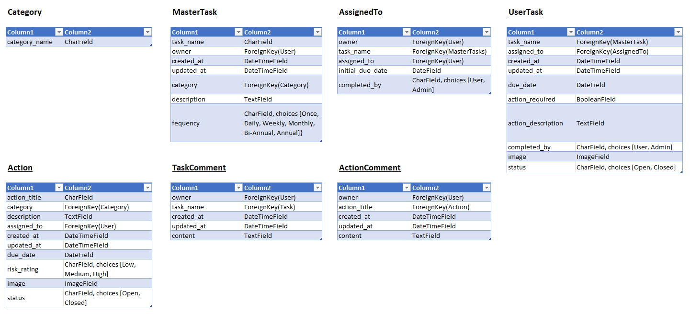

# DCMS - Digital Compliance Management System

<!--  -->

The live link for the site can be found here - https://project5-dcms-react.herokuapp.com/

# Table of Contents
<!-- - [Overview](#overview)
- [UX](#ux)
  - [Strategy](#strategy)
  - [Scope](#scope)
  - [Structure](#structure)
  - [Skeleton](#skeleton)
  - [Surface](#surface)
- [Languages Used](#languages-used)
- [Features](#features)
  - [Existing Features](#existing-features)
  - [CRUD](#crud)
  - [Other Features](#other-features)
  - [Future Features](#future-features)
- [Testing](#testing)
  - [Automated Testing](#automated-testing)
  - [Manual Test of User Stories](#manual-test-of-user-stories)
  - [Test on Alternative Browsers and Screen Size](#test-on-alternative-browsers-and-screen-size)
  - [Debugging](#debugging)
  - [Validator Testing](#validator-testing)
  - [Unfixed Bugs](#unfixed-bugs)
- [Libraries and Programs Used](#libraries-and-programs-used)
- [Deployment](#deployment)
- [Credits](#credits)
  - [Content](#content) -->

# Overview

This site was developed to address a problem which occurred during my previous employment as a Senior Account Manager for a Health and Safety Consultancy. I worked with clients with a large estate of sites throughout the UK. The central health and safety team did not know whether any of the compliance checks were being completed unless they attended site and reviewed the paper checklists used to record the completion of tasks or actions. I have created this site as a way of solving this issue.

# UX

This site was created respecting the Five Planes Of Website Design:

## Strategy

**Typical User**

*Site User*

A typical Site User would be a site manager responsible for the health and safety compliance checks. 

*Site Admin*

A typical Site Admin may be a Health and Safety Manager wanting to ensure that each of their site managers are completing their statutory compliance checks.

The objectives of this site are to:

- Make it quicker and easier for the user to record the completion of safety compliance checks
- Improve the uptake of site managers completing checks
- Improve the ease of safety auditing as records of all checks are detailed in a central location

**User Stories** 

As seen above, there will only be two different types of user of this site (Site User and Site Admin). I have broken down my user stories into these two categories:

*Navigation & Authentication*

- Navigation: As a **site user** I can **view a navbar from every page** so that **I can navigate easily between pages**.
- Routing: As a **site user** I can **navigate through pages quickly** so that **I can view content seamlessly without page refresh**.
- Authentication - Sign up: As a **site user** I can ** create a new account** so that **I can access all the features for signed up users**.
- Authentication - Sign in: As a **site user** I can **sign in to the app** so that **I can access functionality for logged in users**.
- Authentication - Logged in Status: As a **site user** I can **tell if I am logged in or not** so that **I can log in if I need to**.
- Authentication - Refreshing access tokens: As a **site user** I can **maintain my logged-in status until I choose to log out** so that **my user experience is not compromised**.
- Navigation - Conditional rendering: As a **logged out user** I can **I can see sign in and sign up options** so that **I can sign in/sign up**.
- Infinite Scroll: As a **site user** I can **keep scrolling through tasks and actions** so that **I don't have to click on "next page" etc**.

*Categories*

- View Categories List: As a **site admin** I can **view the categories list** so that **I can ensure that all appropriate categories are available to be allocated to a task or action**.
- Add Categories: As a **site admin** I can **create a category** so that **it can be allocated to a task or action**.
- Edit Categories: As a **site admin** I can **edit a category** so that **the correct category can be allocated to a task or action**.
- Delete Categories: As a **site admin** I can **delete a category** so that **it is no longer available to be allocated to a task or action**.

*Master Tasks*

- View Master Task List: As a **site admin** I can **view the master task list** so that **to ensure all users have been allocated the appropriate tasks**.
- View Master Task Details: As a **site admin** I can **view the master task details** so that **to ensure that the correct information has been set on a master task**.
- Add Master Task: As a **site admin** I can **add a master task** so that **I am able to allocate a master task to a user**.
- Edit Master Task: As a **site admin** I can **edit a master task** so that **I am able to update a master task if any of the requirements change**.
- Delete Master Task: As a **site admin** I can **delete a master task** so that **it is no longer available to be allocated to a user**.
- Search for Master Tasks	As a **site admin** I can **search for master tasks** so that **so it is easy to find the master task which I am looking for**.

*Assign Tasks*

- Allocate Master Task to User: As a **site admin** I can **allocate a master task to a user** so that **so a user task can be allocated to them to ensure that an activity is being completed**.
- Set Completed By: As a **site admin** I can **set who the task is to be completed by** so that **either the admin or the user is aware that a task requires completing by them**.

*User Tasks*

- Add User Task: As a **site admin** I can **automatically create a user task once a master task has been allocated** so that **I know a user task has been created which requires completion**.
- View User Task List: As a **site user/site admin** I can **view the user tasks which are to be completed by me** so that **I am aware what tasks I need to completed**.
- View Overdue User Task List: As a **site user/site admin** I can **view the overdue user tasks which are to be completed by me** so that **I can prioritise completing tasks which are overdue**.
- Filter User Tasks: As a **site user/site admin** I can **filter user tasks** so that **so it is eay to find the user task which I am looking for**.
- Search for User Tasks: As a **site user/site admin** I can **search for user tasks** so that **so it is eay to find the user task which I am looking for**.
- View User Task Details: As a **site user/site admin** I can **view a user tasks details** so that **I am aware what tasks I need to completed**.
- Update User Task Status: As a **site user/site admin** I can **update a user tasks status** so that **I can record whether a task has been completed or is in progress**.
- Add Image to User Task: As a **site user/site admin** I can **add an image to a user task** so that **I can provide additional evidence that a task has been completed or that an issue was identified**.

*User Tasks: Comments*

- View Task Comments: As a **site user/site admin** I can **view task comments** so that **I can read the log of detailed information recorded about a task**.
- Add Task Comment: As a **site user/site admin** I can **add a comment to a task** so that **I can record whether an issue has been raised or detail information about the completion of a task**.
- Edit Task Comment: As a **site user/site admin** I can **edit a task comment** so that **I can update an error made in a comment**.
- Delete Task Comment: As a **site user/site admin** I can **delete a task comment** so that **I can delete a comment which has been incorrectly submitted**.
- Task Status Update Comment: As a **site user/site admin** I can **automatically add a comment to detail a change in an tasks status** so that **the comments have a log of any changes to the status of the task**.

*Actions*

- View Action List: As a **site user/site admin** I can **view the actions which are to be completed by me** so that **I am aware what actions I need to completed**.
- View Action Details: As a **site user/site admin** I can **view an actions details** so that **I am aware of the details of the action which I need to completed**.
- Add Action: As a **site user/site admin** I can **add an action** so that **I can record any issues identified so they can be addressed at a later date**.
- Add Action related to a Task: As a **site user/site admin** I can **raise an action if an issue was raise when completing a task** so that **I can record any issues identified when completing a task so they can be addressed at a later date**.
- Edit Action: As a **site user/site admin** I can **edit an action** so that **I am able to update an action if any of the requirements change**.
- Delete Action: As a **site user/site admin** I can **delete an action** so that **I can delete an action which has been incorrectly submitted**.

*Actions: Comments*

- View Action Comments: As a **site user/site admin I can **view action comments** so that **I can read the log of detailed information recorded about an action**.
- Add Action Comment: As a **site user/site admin** I can **add a comment to an action** so that **I can log the progress of the completion of an action**.
- Edit Action Comment: As a **site user/site admin** I can **edit an action comment** so that **I can update an error made in a comment**.
- Delete Action Comment: As a **site user/site admin** I can **delete an action comment** so that **I can delete a comment which has been incorrectly submitted**.
- Action Status Update Comment: As a **site user/site admin** I can **automatically add a comment to detail a change in an actions status** so that **the comments have a log of any changes to the status of the action**.

The user stories where then managed in a Kanban board which was created in [GitHub Projects](https://github.com/users/TuckerFaulk/projects/5/views/1?visibleFields=%5B%22Title%22%2C%22Assignees%22%2C%22Status%22%2C%22Labels%22%2C%22Milestone%22%5D). User stories were then prioritized with the MoSCoW approach and labels where used to manage this. The kanban board was split into five columns to manage the various stages of development:

1. To do: This item hasn't been started
2. In Progress - DRF API: This item is actively being worked on in the DRF API
3. To do - React: This item has tasks related to the React App which have not been started
4. In Progress - React: This item is actively being worked on in the React App
5. Done: All tasks related to the DRF API and the React App have been completed

## Scope

An MVP (Minimum Viable Product) approach was taken to the development of this site.

The main features deemed as basic requirements for this site were:

- Account Registration
- CRUD Functionality (Both Site User and Site Admin)
- Device Responsiveness

For detailed explanation of all existing features see [Existing Features](#existing-features). While [Future Features](#future-features) were still within the possible scope of this project, they were deemed unnecessary at this point in time.

## Structure

**Site Navigation Flowchart**

## Skeleton

**Wireframes**

*Index Page*

<!--  -->

**Database Schema**

<!-- After initially setting out all of the information required for the site, I used data normalisation to structure each relational model to help reduce data redundancy and improve data integrity. -->

## Surface

**Visual Design**

<!-- I selected 'Raleway' as the font style used throughout the site to keep it simple.

The heading background colour of light blue (rgb(108, 171, 221)) was also selected to keep with the minimalist style. I wanted to keep the main background white but then use the colours of the heading background for table headings to ensure that they were the main central focus of the page. Different colours have been used for the buttons on the site to make these easily distinguishable.

Icons were added to buttons throughout the site to aid the understanding of the functionality of that button. -->

# Languages Used

- HTML
- CSS
- JavaScript
- Python
- SQL (Postgres)

# Features

## Existing Features

### Home Page

- The home page provides context of what the site does and how it can provide benefit to the user.

<!--  -->

### Logo

<!--  -->

### Navigation

*User - Logged Out*

<!--  -->

*User - Logged In*

<!--  -->

*Mobile*

<!--  -->

### Favicon

<!--  -->

## CRUD

CRUD (Create, Read, Update, and Delete) functionality has been at the centre of the design for this website and these features have been included for both of the typical users:

**Site User:**

<!-- - CREATE: A site user can add equipment to their calculator
- READ: A site user can view equipment details in their calculator and also in the equipment list
- UPDATE: A site user can edit details of equipment in their calculator
- DELETE: A site user can delete equipment from their calculator -->

**Site Admin:**

<!-- - CREATE: A site admin can add equipment/categories to the equipment/categories list through the admin site
- READ: A site admin can view details of equipment in the equipment list through the admin site
- UPDATE: A site admin can edit equipment/categories in the equipment/categories list through the admin site
- DELETE: A site admin can delete equipment/categories from the equipment/categories list through the admin site -->

## Other Features

## Future Features

<!-- TBC -->

# Testing

## Manual Test of User Stories

## Test on Alternative Browsers and Screen Size

|   Test   |   Small (≥576px) |  Medium (≥768px)   |   Large (≥992px)   |   Functionality (Pass)   |
|----------|:----------------:|:------------------:|:------------------:|:------------------------:|
|Chrome    |      ☑           |         ☑         |         ☑         |            ☑             |
|Safari    |      ☑           |         ☑         |         ☑         |            ☑             |
|Firefox   |      ☑           |         ☑         |         ☑         |            ☑             |
|Edge      |      ☑           |         ☑         |         ☑         |            ☑             |

## Debugging

## Validator Testing

- HTML: All html files were input into the checker and the Jinja code was removed to avoid errors. No errors were returned when passing through the official W3C HTML validator. 

<!--  -->

- CSS: No errors were found when passing through the official W3C CSS validator.

<!--  -->

- JSHint: No errors were found when passing through the JSHint validator.

<!--  -->

- CI Python Linter: No errors were returned when passing through the Code Institute Python Linter.

Havscalcdb - CI Python Linter Screenshots

*urls.py*

<!--  -->

 

- Lighthouse (Accessibility Audit): The page achieved a great accessibility rating.

<!--  -->

## Unfixed Bugs

- CurrentProfileContext
- Warning: validateDOMNesting(...): <ul> cannot appear as a descendant of 
.
- Warning: validateDOMNesting(...): 
 cannot appear as a descendant of 
.

## Libraries and Programs Used

<!-- - Github: Store Repository
- Gitpod: IDE
- Heroku: Site Deployment
- Cloudinary: Serving static media files
- ElephantSQL: PostgreSQL database hosting
- Google Chrome, Microsoft Edge, Mozilla Firefox, Safari: Site testing on alternative browsers
- Chrome Dev Tools: Debugging and CSS testing of the site
- Microsoft OneNote: Planning notes for the project
- Microsoft Whiteboard: Developing wireframes
- Am I Responsive: Screenshots of the final project for the README file
- Lucid Charts: Planning the site process with a flow diagram
- Adobe Photoshop: Photo editing
- Bootstrap: CSS Styling
- Google Fonts: for the font families
- Font Awesome: to add icons to the site
- Real Favicon Generator: Creating Favicon
- ReactJS : To build the components that would collectively form the front-end application.
- React-Bootstrap : The styling library that has aided to the layout of the site, and which was introduced to us during the course of the program.
- Django : Used to build the backend database that serves as an API for the front-end project. -->

## Components

<!-- axiosDefault.js : for ease of communication with the backend API.
Asset.js : to supply the loading spinner & user avatar throughout the site.
DropdownMenu.js : to allow users to edit/delete their Articles, Events & Posts.
CurrentUserContext.js : confirm users logged-in status to determine what functionality is available to that user.
ProfileDataContext.js : provide un/follow ability to other users across PopProf & ProfPage components.
ToggleCollapse.js : whilst this component has only been applied to the NavBarMini, it could in theory be applied to additional dropdown menus installed into the site in the future to allow for the automatic collapse of an element upon mouse click.
useRedirect.js : redirects a user to another page if they are not authorised to be on the page they are trying to access.
utils.js : supplies functionality to all of the components that utilise the Infinite Scroll. -->

**Installed Packages**

<!-- - Cloudinary (1.30.0)
- Dj-database-url (0.5.0)
- Django (3.2.16)
- Django-allauth (0.51.0)
- Django-crispy-forms (1.14.0)
- Gunicorn (20.1.0)
- Psycopg2 (2.9.5)
- Coverage (7.0.5) -->

# Deployment

This project was deployed on Heroku using Code Institute's Videos. After creating a GitHub repository, the steps taken to create the Heroku App were:

<!-- TBC -->

# Credits

I have again enjoyed learning with the Code Institute and completing my fifth assignment. I would like to thank my mentor Martina for her support, the CI Student Support Team and the CI Slack Community. Finally a big thank you to my girlfriend and little sister for their help with testing and the review of this site.

## Content

**Resources Used:**

- Code Institutes Videos

**Images:**

<!-- - [Jackhammer](https://www.istockphoto.com/photo/working-on-a-road-construction-gm164526286-23495173) -->

[Back to Top](#table-of-contents)